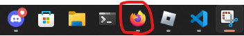

<p align="center">
  <a href="" rel="noopener">
 </a>
</p>

<h3 align="center">Instagram Bot(Poems)</h3>

<div align="center">

[]()
[](https://www.reddit.com/user/Wordbook_Bot)
[](https://github.com/kylelobo/The-Documentation-Compendium/issues)
[](https://github.com/kylelobo/The-Documentation-Compendium/pulls)
[](/LICENSE)

</div>

---

<p align="center"> 🤖 The bot that can send your poems to your instagram account
    <br> 
</p>

## About <a name = "about"></a>

this bot was made because the school i need to create a instagram page and send poems so i made a bot that send for me

## Usage <a name = "usage"></a>

The first thing that you need to know is have already open your account and have firefox inn this exactly position of the hot bar


### Example:

you need to put the poems that you want to send in the json (poems.json) and put the poem in this format:

```json
{
  "poems": [
    {
      "author": "YOUR NAME",
      "title": "POEM TITLE",
      "content": "CONTENT OF THE POEM"
    }
  ]
}
```

and put your name in all of the files that need that like Poems.js and BotClient.js other think put the api access key in .env

### Installing

A step by step series of examples that tell you how to get a development env running.

clone the repository

```
git clone https://github.com/TheGod7/Instagram-Bot.git
```

And then

```
node src/index.js
```
